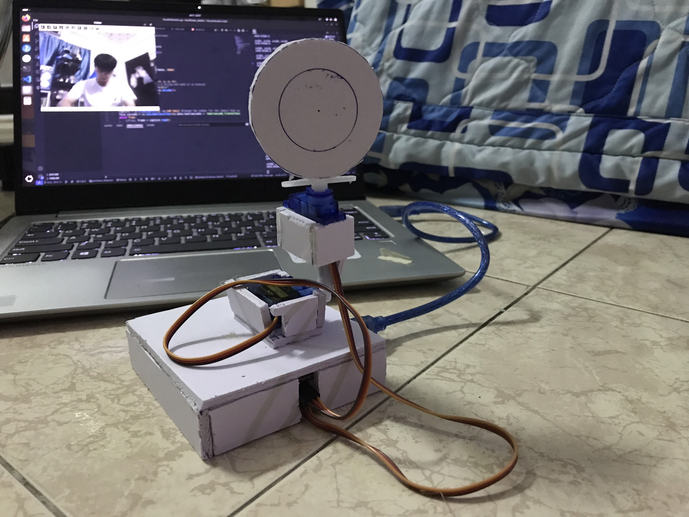

# SUNFLOWER ROBOT

This repository has two branch:
- `master`: for window user
- `linux`: for linux user

## Overview
RSunflower Robot is a robot based on the behavior of sunflowers in nature. It will always orient its face in the direction opposite to that of the user. The robot uses Computer Vison technology to detect and track facial movements on camera or webcam and controls servos to move according to those position parameters.  
## Components
Hardware:
- Arduino UNO board
- Two Servo SG90. It is capable of rotating 180 degrees 

Software:
- **IDE**: Visual Studio Code and installing PlatformIO extension for developing on hardware.
- **Library**:

    - OpenCV `4.10.0` for human face detection using Python
    - pyserial `3.5` for communicating with serial port using Python
    - Servo by `Michael Margolis 1.2.1` on PlatformIO 
## Result
You can watch the demo video on my youtube channel by clicking [here](https://youtube.com/shorts/oLIsh41mzJ8). 

